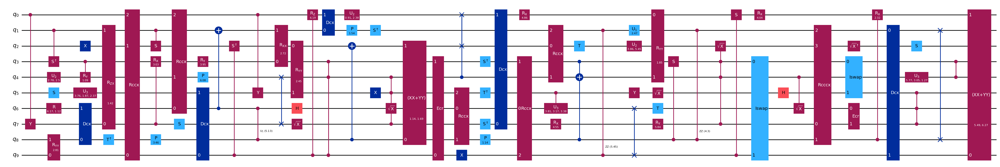
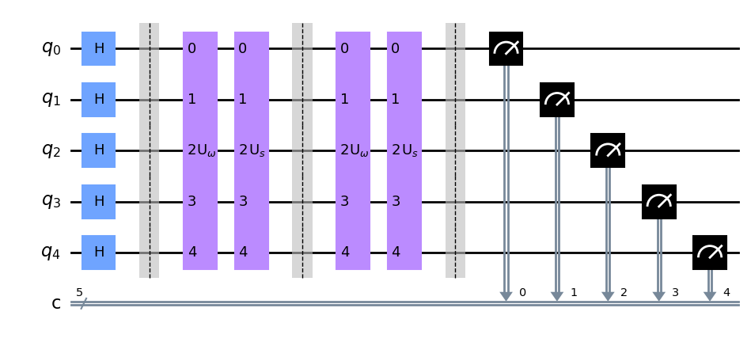
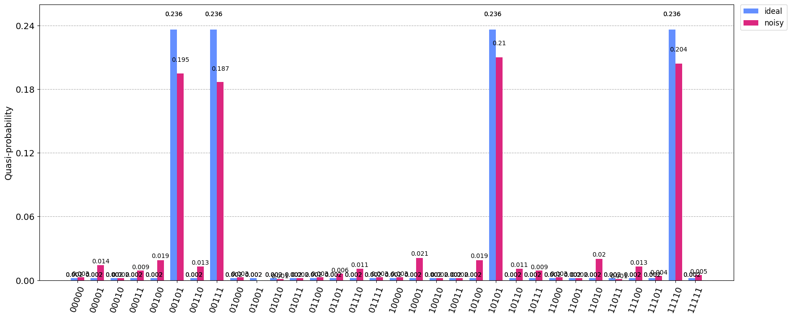
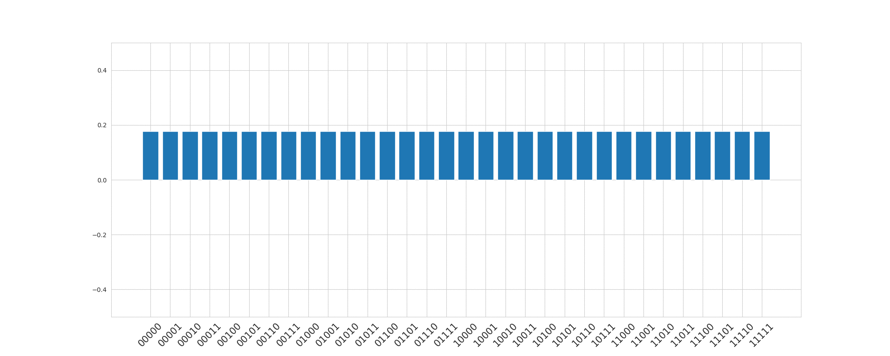
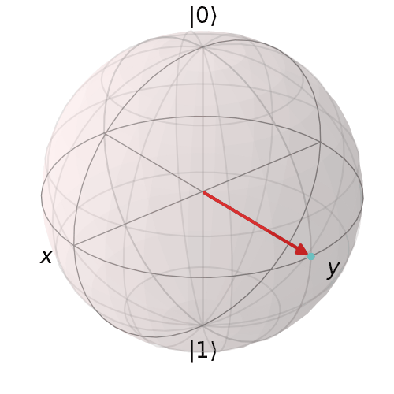
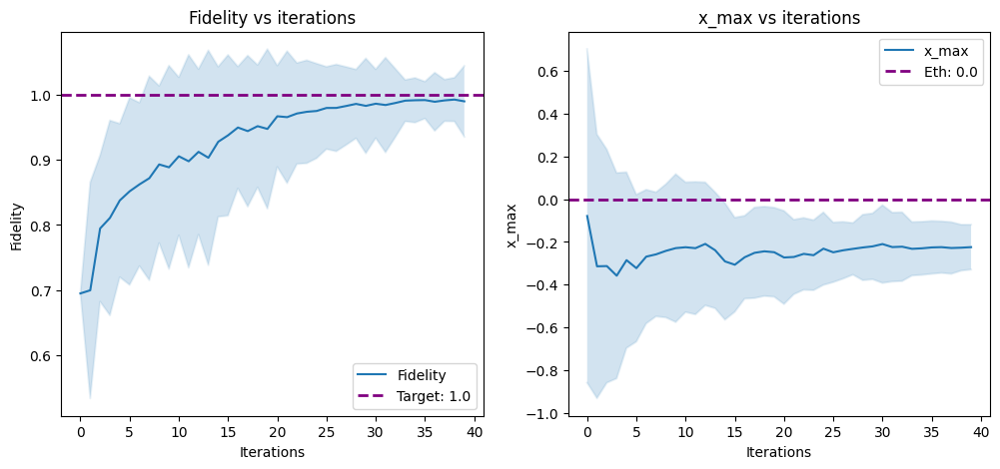

<h1 align="center">ILearnQuantum</h1>

    

## Layerwise learning for Quantum Neural Networks with Qiskit and PyTorch

[Blog][7]  - [Source code](https://github.com/Gopal-Dahale/ILearnQuantum/tree/main/layerwise_learning_with_qiskit_and_pytorch)

The [paper](https://arxiv.org/abs/2006.14904) introduces the concept of layerwise learning to train quantum circuits step-by-step by gradually adding layers and training only a subset of parameters. In this article, we implemented the layerwise learning algorithm using Qiskit and PyTorch. We also talked about barren plateaus and the effectiveness of layerwise learning to overcome them.

    

    The variance of gradients of the expectation value for the ZZ observable.

    
    

    Visualising Barren Plateaus

## Brassard-Høyer-Tapp Algorithm in Qiskit

[Blog][6]

This article is in continuation to the previous one on [collision finding](#quantum-collision-finding) as part of [Womanium](https://womanium.org/Quantum) Global Media Project Initiative 2023. After building on the theoretical foundations, we implemented the BHT algorithm using Qiskit for small hash functions.

    
    

    (Left) Grover's circuit for the BHT algorithm uses 2 iterations of Grover's algorithm to find the collision in a 5-bit hash function. (Right) The output probabilities of the circuit on an ideal and noisy simulator.

## Quantum Collision Finding

[Blog][5]

This blog post was part of the [Womanium](https://womanium.org/Quantum) Global Media Project Initiative 2023. We introduced the concept of finding collisions in hash functions using a quantum algorithm named BHT. A theoretical description of the algorithm and its limitations is presented and is also compared to classical algorithms. The article also introduces concepts like qRAM and collision complexity in classical and quantum settings.

 

    The amplitude of quantum states during Grover's iterations for finding a collision in a 5-bit hash function.

## Deterministic Measurement-based imaginary time evolution | QOSF Fall 22

[Blog][4]  - [Source code](https://github.com/Gopal-Dahale/measurement-based-ite)

<b>Mentor:</b> [Radoica Draškić ](https://www.linkedin.com/in/rdraskic/)

Based on the [recent paper](https://arxiv.org/pdf/2202.09100.pdf), we implemented an imaginary time evolution using conditional unitary operations. We used numpy to implement the algorithm to find the ground states of a given Hamiltonian. The randomness due to measurement is corrected using conditional unitary operations, making the evolution deterministic.

 

    Deterministic Measurement-based imaginary time evolution with a single qubit visualized on Bloch sphere for Pauli Z Hamiltonian.

 

    Fidelity and x_max convergence for Pauli Z Hamiltonian averaged over 100 samples.

## Greetings from the IBM Spring Challenge: Map of 127 Qubits

[Medium blog][3] - [Source code](https://github.com/Gopal-Dahale/ILearnQuantum/tree/main/ibm_quantum_spring_challenge_23)

Working with large-scale quantum systems presents unique challenges, especially when aiming to utilize a significant number of qubits. The physical constraints of devices, such as lengthy pathways and potential error introduction, demand careful consideration. Lab 5 of the [IBM Spring Challenge 23](https://research.ibm.com/blog/quantum-challenge-spring-2023) was to work with 127 qubits on the ibm_sherbrooke device and construct a fully entangled 127-qubit GHZ state. Additionally, we explored the application of error correction techniques to create a reliable 54 qubit GHZ state.

 

    Error corrected circuit for GHZ-State on 54 qubits (total 127 qubits).

## Exploring Tensor Network Circuits with Qiskit | Qiskit Advocate Mentorship Program 2022
[Medium blog][2] - [Source code](https://github.com/Gopal-Dahale/ILearnQuantum/blob/main/tensor_networks_qiskit.ipynb)

<b>Mentor:</b> [Alberto Maldonado Romo](https://www.linkedin.com/in/albertomaldonadoromo/)

<b>Mentees:</b> Me and [Anton Simen Albino](https://www.linkedin.com/in/antonsimen/)

In this medium article, we showcased how to use Qiskit’s circuit library to construct tensor networks like Matrix Product States (MPS) and Tree Tensor Networks (TTN). With a focus on image classification, we demonstrated the application of MPS in classifying digits from the MNIST dataset of handwritten numbers.

 

    The left side of the figure showcases an instance of the tree tensor network (TTN) architecture, while the right side depicts the corresponding quantum circuit. To indicate that a specific unitary operation does not affect a particular qubit and that it is subsequently traced out, we utilize the symbol (\).

 

    Quantum Neural Network using MPS on 4 qubits.

## Quantum Convolutional Neural Networks for High-Energy Physics Analysis at the LHC | GSoC 2022 @ ML4SCI
[Medium blog][1] - [Source code](https://github.com/Gopal-Dahale/qml-hep-lhc)

The goal of this study was to show the capabilities of QML especially QCNN for classifying the HEP image datasets. QCNN can be completely quantum or can be a hybrid with classical. The aim was to implement both. We used quantum variational classification instead of the final FC classical layers in the quantum setting. This provided more depth about the quantum power that can be used in the near-term future.

 

    Mean image of Quark for 3 channels Tracks, ECAL and HCAL (from left to right) over 700k data points.

 

    A data-reuploading circuit on 4 qubits with 2 layers.

[1]: https://dahalegopal27.medium.com/quantum-convolutional-neural-networks-for-high-energy-physics-analysis-at-the-lhc-gsoc-2022-1b367905a955
[2]: https://medium.com/qiskit/exploring-tensor-network-circuits-with-qiskit-235a057c1287
[3]: https://medium.com/@dahalegopal27/greetings-from-the-ibm-spring-challenge-map-of-127-qubits-ce08817176a7
[4]: https://gopal-dahale.github.io/ILearnQuantum/posts/dmbite/dmbite/
[5]: https://gopal-dahale.github.io/ILearnQuantum/posts/bht/quantum_collision_finding/
[6]: https://gopal-dahale.github.io/ILearnQuantum/posts/bht/bht_qiskit/
[7]: https://medium.com/qiskit/layerwise-learning-for-quantum-neural-networks-with-qiskit-e17ff4b1c419
